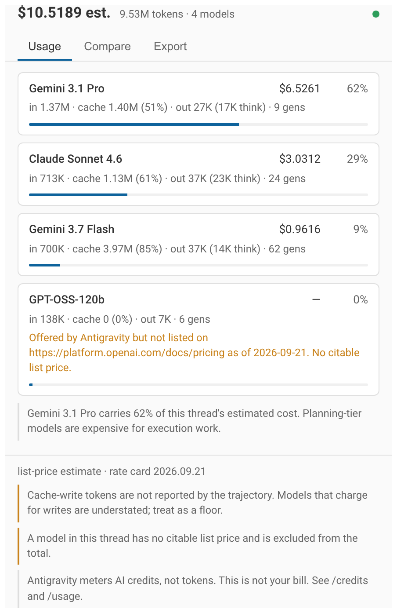
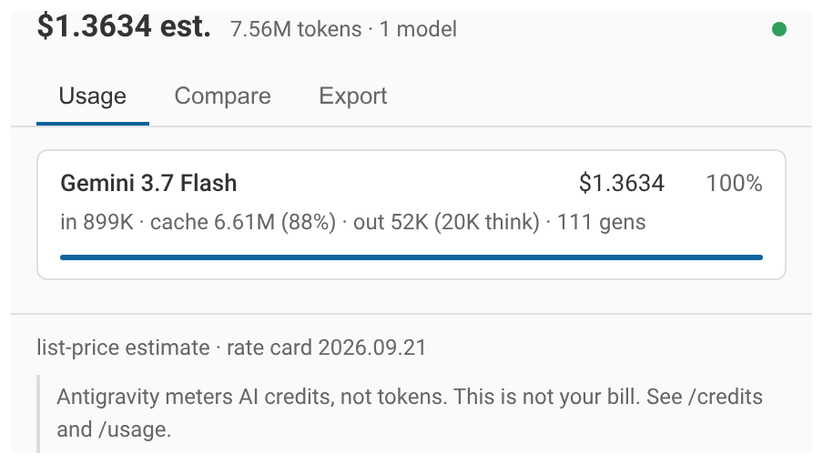
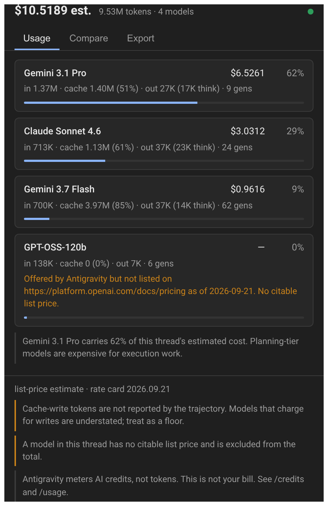
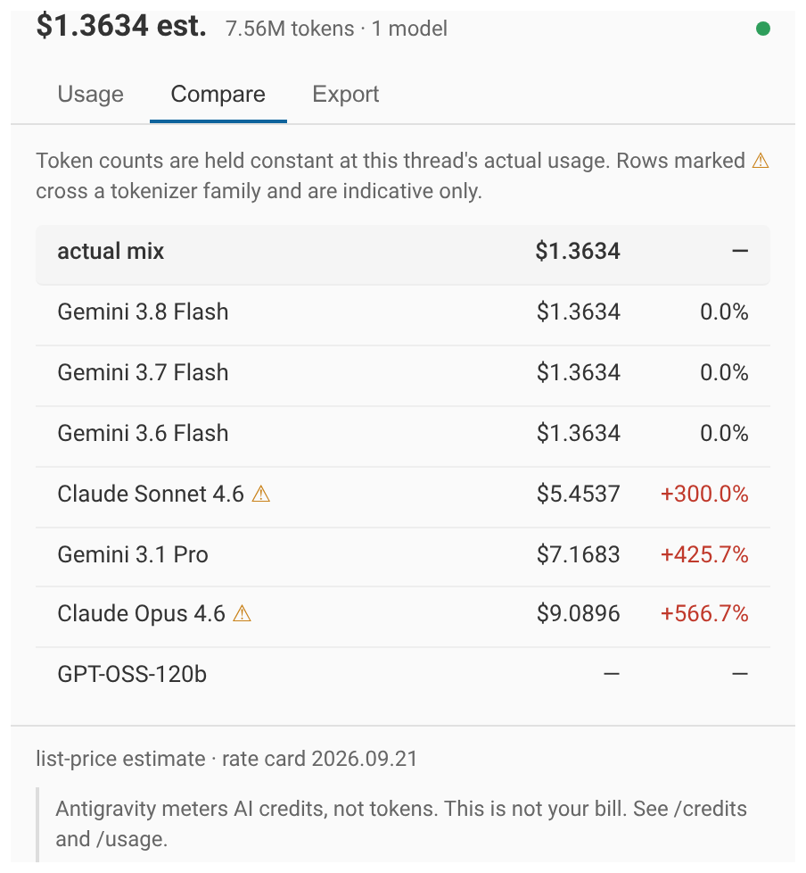
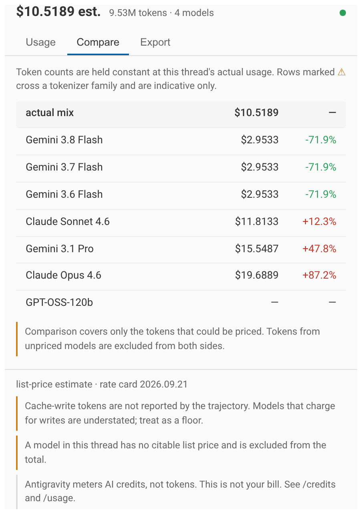
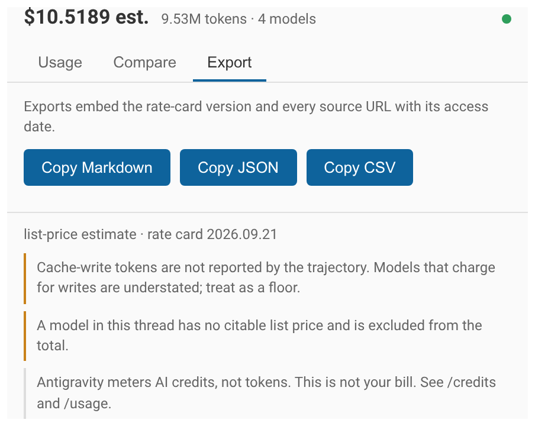
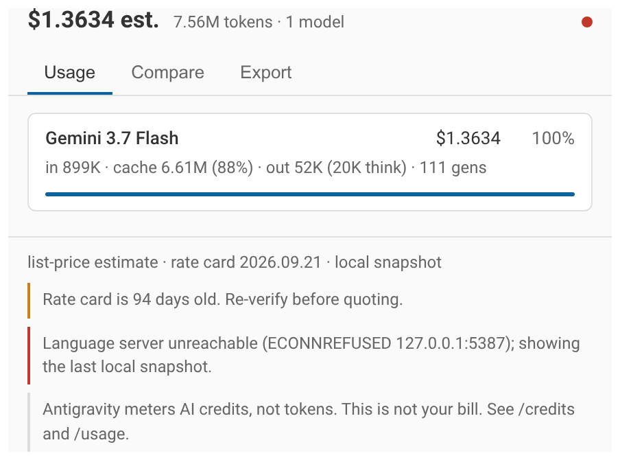
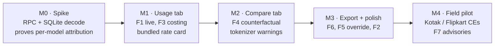

# PRD — Kubera

**An Antigravity UI Plugin for per-thread, per-model token accounting and FinOps comparison.**

| Field | Value |
|---|---|
| Status | Draft for review |
| Revision | 2 — §6 mockups replaced with screenshots of the built plugin |
| Author | Mohan Sridharan |
| Date | 2026-09-21 |
| Target surface | Google Antigravity (IDE + CLI-hosted AuxPane), Jetski Web |
| Plugin type | UI Plugin (Sidecar SDK, Node.js, `has_web_ui: true`) |
| Working name | `kubera` |
| Implementation | `~/repos/kubera` — 31 tests passing |

---

## 1. Problem

Antigravity shows a developer *what* the agent did. It does not show what it cost, by which model, or what the same work would have cost on an alternative model.

Three consequences:

1. **Developers cannot self-correct.** A developer who burns 2M cache-read tokens on Gemini 3.1 Pro for a mechanical refactor has no signal that Gemini 3.8 Flash would have done it for a fraction of the token spend.
2. **Engineering managers cannot defend budget.** Enterprise buyers (Kotak, Flipkart, Swiggy, Agoda) ask for token-level evidence of the cost delta between Antigravity/Gemini and an incumbent Claude Code deployment. Today that evidence is assembled by hand.
3. **The in-product rate card is stale.** The shipped cost table at [`model_cost.go`](http://google3/third_party/jetski/models/model_config/model_cost.go) carries a comment `Cost map was last updated on 06/09/2025` and contains five models — Gemini 2.5 Flash/Pro and Claude 4 Sonnet. It has no entry for any model Antigravity actually offers today. Cost for an unknown model returns `0`.

> [!IMPORTANT]
> The platform already has the accounting *plumbing* — `ConversationCostSummary`, `CostDisplaySection`, `ModelPricingInfo` in [`jetski_cortex.proto`](http://google3/third_party/jetski/jetski_cortex_pb/jetski_cortex.proto) (L215–290). What is missing is a maintained rate card, a per-model view, and a comparative FinOps layer. This plugin supplies those three things without changing the platform.

---

## 2. Goals and non-goals

### Goals

| # | Goal |
|---|---|
| G1 | Show token consumption for the active thread, broken down by model, in the AuxPane, updating as the agent runs. |
| G2 | Attribute tokens across all four billable dimensions: input, cache read, response output, thinking output. |
| G3 | Price that consumption against a versioned, provenance-tagged public list-price table. |
| G4 | Show a counterfactual: what this same thread would have cost on other models. |
| G5 | Export the thread's accounting as JSON/CSV for enterprise FinOps rollups. |
| G6 | Work offline and in air-gapped enterprise environments with no outbound network call. |

### Non-goals

| # | Non-goal | Why |
|---|---|---|
| N1 | Reporting a user's actual Antigravity bill | Antigravity meters **AI credits**, not tokens. No credit-to-token or credit-to-dollar conversion is published. See §4.4. |
| N2 | Org-wide or fleet-wide dashboards | Per-thread scope only. Fleet reporting belongs in BigQuery via Gemini Code Assist log export. |
| N3 | Automatic model switching or routing enforcement | Advisory only. Routing policy is a separate concern. |
| N4 | Replacing the platform's `ConversationCostSummary` | The plugin is additive and read-only. |
| N5 | Billing-grade accuracy | Every figure is a *list-price estimate*. See NF7. |

---

## 3. Users

| Persona | Need | Primary surface |
|---|---|---|
| **Developer** | "Is this thread expensive? Should I have used Flash?" | Live AuxPane panel |
| **Eng manager / budget owner** | "What does an average feature cost, and on which model?" | Exported CSV/JSON, per-thread summaries |
| **Google CE / presales** | "Show the customer a Gemini vs Claude delta on their own repo, from their own session." | Counterfactual tab, screenshot-ready |
| **Enterprise FinOps** | "Attribute spend to teams and workloads." | JSON export into the customer's own pipeline |

---

## 4. Technical context and feasibility

### 4.1 Primary data source

Every sidecar process is launched with language-server credentials in its environment. This is the mechanism the plugin uses, and it is identical across internal Jetski and the external Antigravity app.

| Env var | Purpose |
|---|---|
| `ANTIGRAVITY_LS_ADDRESS` | Language server base URL (loopback) |
| `ANTIGRAVITY_CSRF_TOKEN` | Auth header value for `x-codeium-csrf-token` |
| `ANTIGRAVITY_CONVERSATION_ID` | The active thread. Scopes every query. |
| `ANTIGRAVITY_SIDECAR_WEB_PORT` | Port this sidecar's HTTP server must bind |
| `ANTIGRAVITY_SIDECAR_UI_TOKEN` | `X-Sidecar-Token` value for the plugin's own POST routes |
| `ANTIGRAVITY_EXECUTABLE_DATA_DIR` | Persistent storage across restarts |

The first three are asserted present by the `SidecarApp` constructor, which throws without them.

The plugin polls one Connect-RPC:

```
POST {ANTIGRAVITY_LS_ADDRESS}/exa.language_server_pb.LanguageServerService/GetCascadeTrajectoryGeneratorMetadata
x-codeium-csrf-token: {ANTIGRAVITY_CSRF_TOKEN}
{ "cascadeId": "<conversationId>", "generatorMetadataOffset": 0, "includeMessages": false }
```

Response is a repeated `CortexStepGeneratorMetadata`. Per generation:

| Field | Meaning |
|---|---|
| `chatModel.responseModelFull` / `responseModel` | Actual served model, free-text. **Preferred key.** |
| `chatModel.model` | Model enum. Obfuscated (`MODEL_PLACEHOLDER_M###`). Fallback only. |
| `chatModel.usage.inputTokens` | Uncached prompt tokens |
| `chatModel.usage.cacheReadTokens` | Cache-hit prompt tokens |
| `chatModel.usage.outputTokens` | Total output |
| `chatModel.usage.thinkingOutputTokens` | Reasoning subset of output |
| `chatModel.usage.apiProvider` | e.g. `API_PROVIDER_GOOGLE_GEMINI` |
| `chatModel.timeToFirstToken`, `streamingDuration` | Latency, for cost-per-second views |
| `stepIndices` | Which trajectory steps this generation produced |

This is one model invocation per record, so per-model grouping is a `GROUP BY responseModelFull`. That is the whole of G1.

### 4.2 Fallback data source

When the language server is unreachable (app closed, historical thread), read the local SQLite conversation store:

```
~/.gemini/antigravity/conversations/<conversation-id>.db
```

Verified present on this machine. Relevant tables:

- `steps(idx, step_type, status, metadata BLOB, step_payload BLOB, ...)` — `metadata` is a serialized `ChatModelMetadata`; proto field `9` is usage (`2`=input, `3`=output, `5`=cache read), field `3` is the model enum.
- `gen_metadata(idx, data BLOB, size)` — one row per generation. A spot decode of a real 111-generation thread yielded the literal model string `gemini-3.7-flash` plus `model_enum`, `trajectory_id`, and `request_id`.

Decoding requires only stdlib varint parsing. No Google dependencies. This keeps the plugin viable in the external product.

### 4.3 Sources that do **not** work

Recorded so nobody re-investigates them:

| Source | Verdict |
|---|---|
| `window.sidecar.agent.getConversationMetadata()` | Returns `createdAt`, `status`, `projectId`, `conversationId`, `workspaces`, `agentScript.name`. **No tokens. No model.** |
| `agentapi` CLI | Three subcommands only (`new-conversation`, `send-message`, `get-conversation-metadata`). No telemetry surface. |
| `transcript.jsonl` / `transcript_full.jsonl` | Structural only. `"source":"MODEL"` is a role, not a model name. No usage fields. |
| `reflection_cli` | Internal-only binary (`/google/bin/...`, blaze). Good reference implementation; not shippable externally. |
| Cloud Billing / Vertex usage metrics | Org-admin scoped, minutes-to-hours delayed, not attributable to a live thread. Enterprise reporting complement, not a data source. |

### 4.4 The credits problem

Antigravity does not bill tokens to the end user. Per the [Plans & AI Credits](https://antigravity.google/docs/plans) page (accessed 2026-09-21):

- All plans get a baseline quota, refreshed every five hours on AI Pro/Ultra, weekly otherwise.
- Overage draws **purchased AI credits**, "consumed at standard Gemini Enterprise Agent Platform consumption pricing."
- Rate limits are "correlated with the amount of work done by the agent, which can differ from prompt to prompt."
- No bring-your-own-key, no bring-your-own-endpoint.

**There is no published credit-to-token or credit-to-dollar conversion.** The plugin must therefore never claim to show "your bill." It shows *list-price equivalent*: what this token consumption would cost at published API list prices. That framing is honest, is the number enterprise buyers actually want for TCO comparison, and is defensible in front of a CIO.

Antigravity's own `/credits` and `/usage` slash commands remain the authority on quota. The plugin links to them rather than duplicating them.

### 4.5 Known accounting gotchas

| Gotcha | Handling |
|---|---|
| Cortex sets `inputTokens = max(0, promptTokens − cachedTokens)`. | "Active context" = `inputTokens + cacheReadTokens`. Never sum input alone and call it context. |
| Connect-JSON returns uint64 as **strings**. | Parse, do not coerce. |
| The RPC is size-paginated. | Loop `generatorMetadataOffset` until the page is empty. |
| `ModelUsageStats` exposes `cache_read_tokens` but not `cache_write_tokens` on the mainline message. | Anthropic charges cache writes at 1.25x (5m) / 2x (1h) base input. Without write counts, Claude cost is **understated**. Must be disclosed in the UI. See R3. |
| Subagents are separate conversations. | Walk child conversations for a thread-tree total. Show direct and subagent costs separately, mirroring `TurnCostSummary`. |
| Model enums are obfuscated placeholders. | Key on `responseModelFull`; ship an enum→display-name map as a last resort. |

### 4.6 Precedent

Working implementations to borrow from, all doing a subset of this:

- `//depot/google3/fitbit/internal/ai/plugins/jetski_session_telemetry` — AuxPane sidecar over the same RPC; also pulls display names from the model-picker RPC.
- `//depot/google3/experimental/users/mnett/jetski_radar/server/index.ts` — Node/TS reference for `gm?.chatModel?.usage`.
- `//depot/google3/experimental/users/diegoparedes/plugins/context_lens` — real-time context/token breakdown panel.
- `//depot/google3/prototypes/projects/groupagent-clank-commons/tools/jetski_quota` — per-model cost bucketing.

---

## 5. Functional requirements

### F1 — Live consumption by model (P0)

Grouped by `responseModelFull`, for the active thread:

| Column | Source |
|---|---|
| Model | `responseModelFull` |
| Generations | count |
| Input | Σ `inputTokens` |
| Cache read | Σ `cacheReadTokens` |
| Cache hit % | `cacheRead / (input + cacheRead)` |
| Output | Σ `outputTokens` |
| ├ Thinking | Σ `thinkingOutputTokens` |
| └ Response | `output − thinking` |
| List-price est. | §F3 |
| Share of thread | % of thread total cost |

Scopes: **This turn**, **This thread**, **Thread + subagents**.

Refresh: poll at 3 s while the agent is running, 30 s when idle. Incremental — request only new offsets.

### F2 — Cost attribution over time (P1)

Sparkline of cumulative estimated cost across the thread, with per-turn markers. Answers "which turn got expensive." Reuses `stepIndices` to align cost to visible steps.

### F3 — List-price costing (P0)

For each generation, cost is computed with the rate card of the model that produced it, never a thread-wide card. This mirrors the deliberate design note in `CostDisplaySection.pricing` (L247–255).

```
cost = input_tokens      × input_rate
     + cache_read_tokens × cache_read_rate
     + output_tokens     × output_rate        // thinking billed as output
     [+ cache_write_tokens × cache_write_rate]  // when available
```

Context-length tiering is applied per generation where the vendor tiers (e.g. Gemini 3.1 Pro at the 200k boundary).

Every figure carries a provenance badge: `list price · <source> · <date accessed>`. If a model has no rate card entry, show `—`, never `$0.00`.

### F4 — FinOps counterfactual (P0)

The differentiator. For the same token profile, show what the thread would cost on other models.

**Default comparison set:** the models Antigravity actually offers. Per the [Models](https://antigravity.google/docs/models) page (accessed 2026-09-21):

| Model | Free & AI Plus | AI Pro | AI Ultra | Enterprise |
|---|---|---|---|---|
| Gemini 3.8 Flash | ✅ | ✅ | ✅ | ✅ |
| Gemini 3.7 Flash | ✅ | ✅ | ✅ | ✅ |
| Gemini 3.6 Flash | ✅ | ✅ | ✅ | ✅ |
| Gemini 3.1 Pro | ✅ | ✅ | ✅ | ✅ |
| Claude Sonnet 4.6 (thinking) | ✅ | ✅ | ✅ | ❌ |
| Claude Opus 4.6 (thinking) | ✅ | ✅ | ✅ | ❌ |
| GPT-OSS-120b | ✅ | ✅ | ✅ | ❌ |

Output: a ranked table — model, estimated cost, delta vs actual, delta %.

> [!WARNING]
> **Tokenizer parity is the hard part.** Anthropic's pricing page states that Claude 4.7 and later use a newer tokenizer producing **approximately 30% more tokens for the same text**; Sonnet 4.6 and earlier use the previous tokenizer. A naive "same token count, different rate card" comparison is therefore wrong across tokenizer families.
>
> v1 must present the counterfactual as **token-count-held-constant**, label it explicitly as such, and surface a tokenizer-family warning whenever the comparison crosses families. A tokenizer-normalized mode is a v2 item (see §12, Q3).

Second-order caveats to display, not hide:
- Cache-hit rate will differ between models. Held constant in v1.
- A cheaper model may need more turns. The plugin measures price, not total cost of outcome.
- **The comparison basis is the priced token subset, not the whole thread.** If any model in the thread has no citable list price, its tokens are absent from the baseline cost, so they must also be excluded from the candidates — otherwise every candidate is charged for tokens the baseline never counted and every delta is overstated. The narrower basis must be stated in the UI and in exports. See §6.5 for the defect that motivated this.

### F5 — Pricing table management (P0)

```jsonc
{
  "schema_version": "1.0",
  "table_version": "2026.09.21",
  "models": [{
    "match": ["gemini-3.8-flash", "gemini-3.8-flash-*"],
    "display_name": "Gemini 3.8 Flash",
    "vendor": "google",
    "source_url": "https://ai.google.dev/gemini-api/docs/pricing",
    "date_accessed": "2026-09-21",
    "rates": [{
      "effective_from": "2026-01-01",
      "effective_to":   "2026-12-31",
      "input_per_mtok": 0.75,
      "output_per_mtok": 3.75,
      "cache_read_per_mtok": 0.075,
      "cache_write_per_mtok": null,
      "cache_storage_per_mtok_hour": 0.50,
      "thinking_billed_as": "output"
    }, {
      "effective_from": "2027-01-01",
      "input_per_mtok": 1.50,
      "output_per_mtok": 7.50,
      "cache_read_per_mtok": 0.15,
      "cache_storage_per_mtok_hour": 1.00,
      "thinking_billed_as": "output"
    }],
    "context_tiers": null
  }]
}
```

Requirements:

1. **Bundled, versioned, offline-first.** The table ships with the plugin. Zero network calls in the default configuration — mandatory for Kotak-class zero-egress environments.
2. **Effective-date ranges, not single prices.** Non-negotiable: Google's published Gemini 3.x rates double on 2027-01-01. A single-price schema silently under-forecasts from that date.
3. **Optional remote refresh,** default **off**, 24 h TTL, fail-soft to the bundle. Mirror to a controlled endpoint; never hot-link a community file into a customer-facing cost number.
4. **Org override file** at `${ANTIGRAVITY_EXECUTABLE_DATA_DIR}/pricing.override.json`. Enterprise customers have committed-use and EDP discounts; list price is wrong for them by construction.
5. **Staleness badge** when `table_version` is older than 60 days.
6. [LiteLLM's `model_prices_and_context_window.json`](https://raw.githubusercontent.com/BerriAI/litellm/main/model_prices_and_context_window.json) is a useful **change detector** — its schema covers `input_cost_per_token`, `cache_read_input_token_cost`, `cache_creation_input_token_cost`, `input_cost_per_token_above_200k_tokens`, `output_cost_per_reasoning_token` (all field names verified present). Use it to trigger a human re-read of the vendor page. Never as the citable source.

### F6 — Export (P1)

`Copy JSON`, `Copy Markdown table`, `Download CSV`. Payload includes `conversationId`, per-model rows, per-generation rows, `table_version`, and every `source_url` + `date_accessed`. Markdown export must be paste-ready into a customer doc.

### F7 — Efficiency signals (P2)

Derived from data already fetched. Each is a one-line advisory, not a nag:

- **Cache hit rate below 40% on a long thread** → context is churning.
- **Thinking tokens above 50% of output** → consider a lower thinking level.
- **Pro-tier model on a thread with no plan/spec artifact** → execution work on a planning-tier model.

These map directly to the Supervisor-Worker and policy-routing archetypes already being sold into JAPAC accounts.

---

## 6. UX

Single AuxPane view, three tabs. Host theme tokens only (`--background`, `--card`, `--foreground`, `--muted-foreground`, `--primary`, `--border`) with literal fallbacks so the page is legible when opened standalone during development. No `--vscode-*`.

The images below are screenshots of the built plugin, not drawings. They were produced by serving the shipped `index.html` / `styles.css` / `app.js` against snapshots built by the shipped `lib/` code, at a 440 px AuxPane width. Two data sets are used, and they are labelled per image:

| Data set | Meaning |
|---|---|
| **measured** | The 111-generation thread decoded from a real local conversation database (`tests/fixtures/gen_metadata.json`). Every number is a decode of actual trajectory bytes. |
| **synthetic** | A constructed multi-model thread. Token volumes are invented; they exercise states the measured thread cannot reach — a mid-thread model switch, an unpriced model, and a planning-tier model dominating spend. Costs are still computed by the real pricing code against the real rate card. |

### 6.1 Usage tab

The default view. One card per model, sorted by cost, each showing generations, input, cache read with hit rate, output with thinking split, and share of thread.

````carousel

<!-- slide -->

<!-- slide -->

````

**Slide 1 — synthetic.** Four models. Note the behaviours this is proving out:

- GPT-OSS-120b reports its tokens but shows `—` for cost, with the reason inline: *offered by Antigravity but not listed on the OpenAI pricing page as of 2026-09-21*. An unpriced model is never silently costed at zero (F3).
- The advisory fires because Gemini 3.1 Pro carries 62% of spend off 9 generations out of 101 (F7).
- Footer caveats stack: cache-write understatement, unpriced exclusion, and the standing credits disclaimer.

**Slide 2 — measured.** The decoded thread: 111 generations, 898,544 input, 6,608,659 cache read, 88.0% hit rate, 51,701 output of which 20,316 thinking. Priced at $1.3634 against the 2026.09.21 rate card. No advisories fire, which is the correct result for a well-cached single-model thread.

**Slide 3 — dark host theme.** Same payload as slide 1 with host dark tokens injected. Confirms NF7: no hard-coded colours survive except the semantic status hues (amber warning, red error, green live).

### 6.2 Compare tab

````carousel

<!-- slide -->

````

**Slide 1 — measured.** The actual mix pins the top row; candidates are ranked cheapest first with the delta against it. The three Flash generations price identically because they share a rate, and render as a neutral `0.0%` rather than a false saving. Claude rows carry ⚠ because this thread is Gemini-only, so switching crosses a tokenizer family and the held-constant token assumption no longer holds.

**Slide 2 — synthetic.** The thread already used Claude, so no row crosses a tokenizer family and no ⚠ appears. The amber note under the table states that the comparison covers only the tokens that could be priced.

> [!IMPORTANT]
> The ⚠ marker is not decoration. Anthropic states Claude 4.7 and later tokenize the same text into roughly 30% more tokens than Sonnet 4.6 and earlier. A cross-family row holds token counts constant across tokenizers that do not agree on what a token is. We flag it rather than applying a correction factor we cannot source per workload.

### 6.3 Export tab



Three buttons, clipboard only. No file dialog, no upload. The rendered Markdown for the measured thread, verbatim:

```markdown
# Token consumption — thread `8c3ad74d-a102-4bce-ac6a-105128e3bffd`

**Total: $1.3634 estimated · 7,558,904 tokens · 1 model(s)**

| Model | Gens | Input | Cache read | Hit % | Output | Thinking | Est. cost | Share |
|---|---:|---:|---:|---:|---:|---:|---:|---:|
| Gemini 3.7 Flash | 111 | 898,544 | 6,608,659 | 88.0% | 51,701 | 20,316 | $1.3634 | 100.0% |

## Counterfactual — same token counts, other models

> Token counts are held constant. Rows marked ⚠ cross a tokenizer family, so the comparison is indicative only.

| Model | Est. cost | Δ vs actual | Δ % | |
|---|---:|---:|---:|---|
| Gemini 3.8 Flash | $1.3634 | $0.0000 | 0.0% |  |
| Gemini 3.7 Flash | $1.3634 | $0.0000 | 0.0% |  |
| Gemini 3.6 Flash | $1.3634 | $0.0000 | 0.0% |  |
| Claude Sonnet 4.6 | $5.4537 | $4.0903 | 300.0% | ⚠ |
| Gemini 3.1 Pro | $7.1683 | $5.8048 | 425.7% |  |
| Claude Opus 4.6 | $9.0896 | $7.7261 | 566.7% | ⚠ |
| GPT-OSS-120b | — | — | — |  |

## Provenance

| Model | Source | Accessed |
|---|---|---|
| Gemini 3.7 Flash | https://ai.google.dev/gemini-api/docs/pricing | 2026-09-21 |

- List-price estimate only. Antigravity meters AI credits, not tokens, and publishes no credit-to-token conversion, so this is not a bill.
- Rate card 2026.09.21.
```

Every export carries the provenance table and the disclaimer block. A cost figure leaves this plugin with its source URL and access date attached or it does not leave at all.

### 6.4 Degraded state



Language server unreachable, serving the local SQLite snapshot, on a rate card 94 days old. Three things change and nothing is hidden: the status dot turns red, the provenance line appends `local snapshot`, and two caveats appear — the staleness warning in amber and the connection error in red. The numbers still render, because a stale number with a visible warning is more useful than an empty pane.

### 6.5 What building the mockups changed

Rendering the real UI against real data caught two defects that the ASCII mockups in the previous revision of this section could not have caught.

> [!WARNING]
> **The delta column collapsed whenever any model was unpriced.** The counterfactual required the thread total to be fully priced before computing any delta. One GPT-OSS-120b generation therefore blanked every row in the Compare tab, silently, with no explanation. The feature's entire value proposition disappeared in the exact case the PRD spends most effort on.
>
> Fixed by basing the counterfactual on the *priced token subset* — tokens from unpriced models are now excluded from both the baseline and the candidates, so the two sides cover the same volume — and surfacing that narrower basis in the UI and in exports. Pinned by two tests.

> [!WARNING]
> **Identically priced models rendered as a saving.** Summing per-generation costs leaves float residue, so a model on the same rate as the actual mix landed on a delta of about `-1e-15` and displayed as a green `-0.0%`. A rounding artefact was presenting itself as a reason to switch models. Deltas below display precision now render as a neutral `0.0%` in both the UI and the Markdown export.

Both were found only because the mockup was the real component. Neither would have survived to production, but both would have cost a review cycle.

Sample figures in this section are labelled measured or synthetic per image; see the table at the top of §6.

---

## 7. Non-functional requirements

| # | Requirement |
|---|---|
| NF1 | **Zero egress by default.** No outbound network call unless remote pricing refresh is explicitly enabled. |
| NF2 | **No prompt content leaves the process.** Always call the RPC with `includeMessages: false`. Never read `systemPrompt` or `messagePrompts`. |
| NF3 | **Read-only.** No writes to the trajectory, no injected steps, no agent messages. |
| NF4 | Poll must not perceptibly affect agent latency. Incremental offsets; back off to 30 s when idle; stop polling when the pane is closed. |
| NF5 | **Degrade, never lie.** Missing rate card → `—`. Unreachable LS → fall back to SQLite and badge as "snapshot." Unknown model → list tokens, omit cost. |
| NF6 | Node.js sidecar only, per the external Antigravity runtime constraint. |
| NF7 | Every dollar figure in the UI is labelled an estimate and carries its table version. |

---

## 8. Metrics

| Metric | Target |
|---|---|
| Pane opened per active thread | ≥ 25% of threads within 60 days |
| Export used | ≥ 1 export per active user per week (proxy for manager/CE value) |
| Rate-card coverage | 100% of models in the Antigravity model selector |
| Estimate drift vs `ConversationCostSummary` where both defined | within 2% |
| Reported wrong-price defects | 0 |

---

## 9. Risks

| # | Risk | Mitigation |
|---|---|---|
| R1 | RPC name/shape changes | Version-probe at startup; fall back to SQLite; fail visibly, not silently. |
| R2 | Stale rate card ships a wrong number to a customer | Effective-date ranges, staleness badge, provenance on every row, quarterly refresh owner named. |
| R3 | Claude cost understated (no cache-write counts) | Disclose in the UI footer. File a platform request to surface `cache_write_tokens` in `ModelUsageStats`. |
| R4 | Tokenizer skew invalidates cross-vendor comparison | Explicit "token counts held constant" label + cross-family warning. Normalization is v2. |
| R5 | Users read "list-price estimate" as "my bill" | Never render a credits figure. Persistent disclaimer. Link to `/credits` and `/usage`. |
| R6 | Model enum obfuscation breaks grouping | Prefer `responseModelFull`; ship an enum map; bucket unknowns as "Unidentified model" rather than dropping them. |
| R7 | Security review flags an authenticated loopback call from a plugin | Credentials are injected by the host into every sidecar. Document that the plugin reads only its own inherited env and never persists the token. |

---

## 10. Milestones



| Milestone | Exit criteria |
|---|---|
| **M0** | A Node script prints per-model token totals for a live thread via the RPC, and for a closed thread via SQLite. |
| **M1** | AuxPane shows F1 + F3 with provenance. Matches `ConversationCostSummary` within 2% where both are defined. |
| **M2** | Compare tab ranks the seven Antigravity models with correct warnings. |
| **M3** | Export produces paste-ready Markdown; org override honoured; zero-egress verified. |
| **M4** | Two CEs use the export in a live customer conversation and file feedback. |

---

## 11. Rollout

Ship as a standard plugin bundle. Mirrors the layout already used for `chitragupta` and the Asana plugin.

```
tokenomics_lens/
├── plugin.json
├── README.md
├── assets/logo.svg
└── sidecars/tokenomics_lens/
    ├── sidecar.json        # has_web_ui: true, SIDECAR_UI_ENTRYPOINT_AUX_PANE
    ├── main.mjs            # SidecarApp: RPC poller, SQLite fallback, costing
    ├── pricing.json        # bundled, versioned rate card
    ├── index.html
    └── styles.css
```

Distribution: internal dogfood to the JAPAC CE team first, then the org plugin marketplace — which is itself an open Flipkart evaluation item (Vinamra Bansal's question 2 on org-scoped Skill/MCP/Plugin marketplaces).

---

## 12. Open questions

| # | Question | Owner |
|---|---|---|
| Q1 | Do we pursue a platform change to surface `cache_write_tokens` in `ModelUsageStats`, or accept understated Claude cost in v1? | Product + Jetski eng |
| Q2 | Should the plugin consume `CascadeState.cost_summary` (field 16) when present and reconcile against its own maths, or ignore the platform figure entirely to avoid two conflicting numbers on screen? | Eng |
| Q3 | Is tokenizer normalization worth building, or is a labelled caveat sufficient for the sales motion? | Product |
| Q4 | Who owns the quarterly rate-card refresh, and what is the SLA? | TBD — must be named before M3 |
| Q5 | Does showing an explicit Gemini-vs-Claude dollar delta conflict with the Flipkart guidance to lead with structural percentage TCO rather than absolute dollars? Suggest a per-deployment toggle for "percentage only" mode. | Product + field |
| Q6 | Ship a `/tokenomics` slash command alongside the pane, for CLI users with no AuxPane? | Product |

---

## Appendix A — Verified list prices

All rows read directly from the vendor page on the date shown. Prices in USD per 1M tokens. **These seed the bundled rate card; they are not a substitute for it.**

### A.1 Google — `https://ai.google.dev/gemini-api/docs/pricing` (accessed 2026-09-21)

Standard tier, paid. Output prices include thinking tokens.

| Model | Input | Output | Cache read | Cache storage | Note |
|---|---|---|---|---|---|
| `gemini-3.8-flash` | $0.75 | $3.75 | $0.075 | $0.50 /1M/hr | Through 2026-12-31 |
| `gemini-3.8-flash` | $1.50 | $7.50 | $0.15 | $1.00 /1M/hr | From 2027-01-01 |
| `gemini-3.7-flash` | $0.75 | $3.75 | $0.075 | $0.50 /1M/hr | Through 2026-12-31; doubles 2027-01-01 |
| `gemini-3.6-flash` | $0.75 | $3.75 | $0.075 | $0.50 /1M/hr | Through 2026-12-31; doubles 2027-01-01 |
| `gemini-3.1-pro-preview` | $2.00 (≤200k)<br/>$4.00 (>200k) | $12.00 (≤200k)<br/>$18.00 (>200k) | $0.20 / $0.40 | $4.50 /1M/hr | Context-tiered |
| `gemini-3.5-flash-lite` | $0.30 | $2.50 | $0.03 | $1.00 /1M/hr | |
| `gemini-3.1-flash-lite` | $0.25 (text/img/video)<br/>$0.50 (audio) | $1.50 | $0.025 / $0.05 | $1.00 /1M/hr | |
| `gemini-3-flash-preview` | $0.50 (text/img/video)<br/>$1.00 (audio) | $3.00 | $0.05 / $0.10 | $1.00 /1M/hr | Legacy |

Batch and Flex tiers are listed at 50% of standard for the Gemini 3.x Flash family. Priority tier is listed at $1.35 / $6.75 / $0.135 through 2026-12-31.

### A.2 Anthropic — `https://platform.claude.com/docs/en/about-claude/pricing` (accessed 2026-09-21)

| Model | Base input | 5m cache write | 1h cache write | Cache hit | Output |
|---|---|---|---|---|---|
| Claude Opus 4.6 | $5 | $6.25 | $10 | $0.50 | $25 |
| Claude Sonnet 4.6 | $3 | $3.75 | $6 | $0.30 | $15 |
| Claude Sonnet 5 | $2 | $2.50 | $4 | $0.20 | $10 |
| Claude Haiku 4.5 | $1 | $1.25 | $2 | $0.10 | $5 |
| Claude Fable 5.1 | $10 | $12.50 | $20 | $0.25 | $50 |
| Claude Opus 5 | $5 | $6.25 | $10 | $0.50 | $25 |

Stated on the same page:
- Cache hits are 0.1x base input for all models except Fable 5.1 and Mythos 5.1, which are 0.025x.
- **Claude 4.7 and later use a newer tokenizer producing ~30% more tokens for the same text. Sonnet 4.6 and earlier use the previous tokenizer.**
- Regional and multi-region endpoints carry a 10% premium over global.

### A.3 OpenAI — `https://platform.openai.com/docs/pricing` (accessed 2026-09-21)

Standard tier, short context / long context.

| Model | Input | Cached input | Cache write | Output |
|---|---|---|---|---|
| `gpt-6-astra` | $10.00 / $20.00 | $1.00 / $2.00 | $12.50 / $25.00 | $50.00 / $75.00 |
| `gpt-5.6-sol` | $4.00 / $8.00 | $0.40 / $0.80 | $5.00 / $10.00 | $20.00 / $30.00 |
| `gpt-5.6-terra` | $2.00 / $4.00 | $0.20 / $0.40 | $2.50 / $5.00 | $12.00 / $18.00 |
| `gpt-5.6-luna` | $0.20 / $0.40 | $0.02 / $0.04 | $0.25 / $0.50 | $1.20 / $1.80 |

Regional processing endpoints carry a 10% uplift for models released on or after 2026-03-05. Batch tier is listed separately.

### A.4 Not verified

| Item | Status |
|---|---|
| `GPT-OSS-120b` list price | Not present on the OpenAI pricing page. Antigravity offers the model. **Rate card entry blocked pending a source.** |
| `Nano Banana 2` (generative image tool) | Not priced here. Image generation is out of v1 scope. |
| Vertex AI rates vs Gemini API rates | Not compared. They can differ and must be modelled as separate rate cards if Vertex-routed deployments are in scope. |
| Credit-to-dollar conversion for Antigravity | Not published. See §4.4. |
